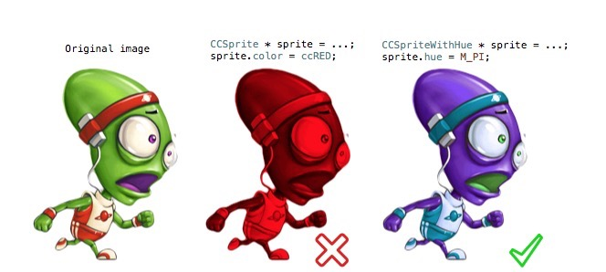
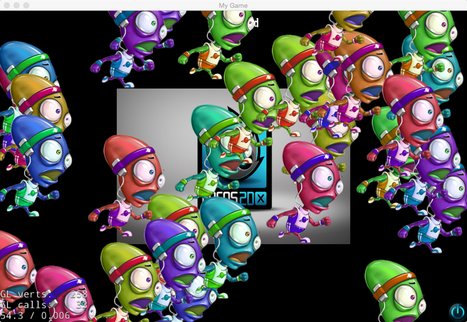

### SpriteWithHue

---

这个类主要实现的功能是对cocos2d::Sprite色调的修改，从而达到一套纹理可以重复利用的目的，特别对于一些只需在颜色上换装的游戏来说，真是大大的福利。

这是我从[CCSpriteWithHue Github](https://github.com/alex314/CCSpriteWithHue)扒过来，从Cocos2d-iphone移植到Cocos2d-x，并进行了适当的修改。

感谢原作者[Alex314](https://github.com/alex314)。

实现的效果如图：



支持Sprite以及Animtion。使用的引擎版本是**Cocos2d-x v3.5 Final**。

测试例如图：




使用方式很简单，和cocos2d::Sprite一样，只是多了一个
setHue(float hue)接口用于设置色调，范围处于0~2π。

示例代码：

```cpp
	auto alien = SpriteWithHue::create("alien.png");
	alien->setPosition(Vec2(100, 100));
	alien->setHue(M_PI);
	this->addChild(alien);
```

实现以及测试例在[https://github.com/fusijie/SpriteWithHue](https://github.com/fusijie/SpriteWithHue)


